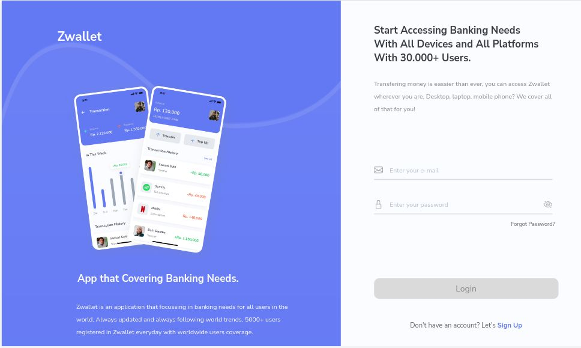
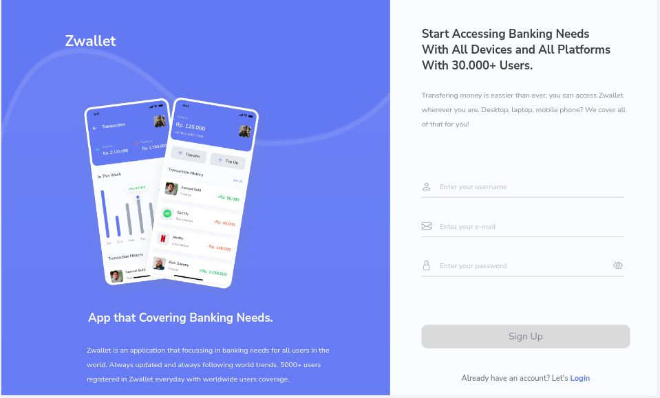
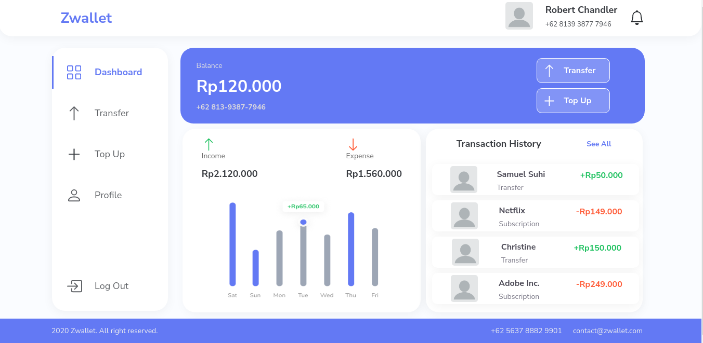
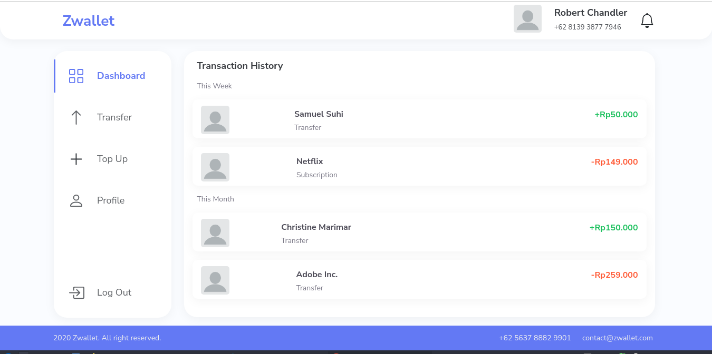
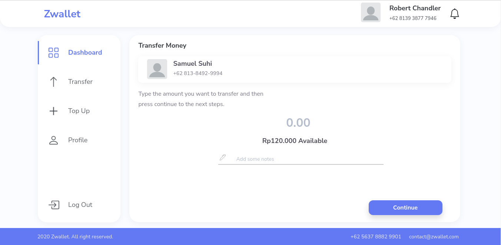
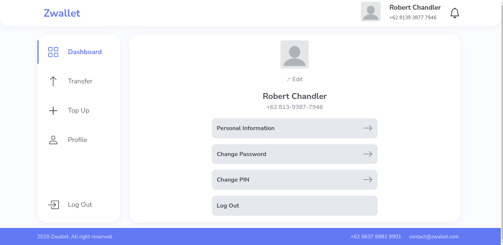

# Zwallet! Awesome App For Saving Times.

Hello! My name's **Ferdi** and I'm part of the Developer Team who built **Zwallet**! I'm here to inform you about this cool apps. **Zwallet** is a website application that offering the simplicity and rapidity for anything related to banking needs.

> **Zwallet** is a mobile-first web app that currently available in Responsive Layout for 3 breakpoints: less than 567px (default layout), 768px (tablet layout), 1200px (desktop layout).

## Built With

- [React.js](https://reactjs.org/)

## Installation

1. Clone the repo
   ```sh
   git clone https://github.com/ferdianfh/zwallet-web-app.git
   ```
2. Install NPM packages
   ```sh
   npm install
   ```
3. Start the Application
   ```sh
   npm start
   ```

Or you can try it here: [Zwallet Web App](https://zwallet-web-app.netlify.app/auth/login)

## Pages

Some Pages that currently available in **Zwallet**:

- **Login**, if you already have an account.
- **Sign Up**, if you need to create an account.
- **Reset Password**, if you already have an account but forgot the password.
- **Dashboard**, you can check the your balance and other activities in this app.
- **Transaction History**, you can check your transaction history from _incomes_ to _expenses_, from _weekly_ to _monthly_.
- **Transfer Receiver**, you can share happiness by send them some _bills_ from this page, it will show your list of contacts.
- **Transfer Input**, input amount _bills_ you want to transfer.
- **Transfer Confirmation**, check and confirm your details.
- **Transfer Status**, it will show you either your transaction is _success_ or _failed_.
- **Top Up**, you can re-fill your balance anytime.
- **Profile**, you can customize or edit your profile.

## Snippets

Here are some snippets about this app:

- Login



- Sign Up



- Dashboard



- Transaction



- Transfer



- Profile



## Zwallet Update!

**Zwallet** is currently on development process!

Last Updated on Monday, 17/01/2022
